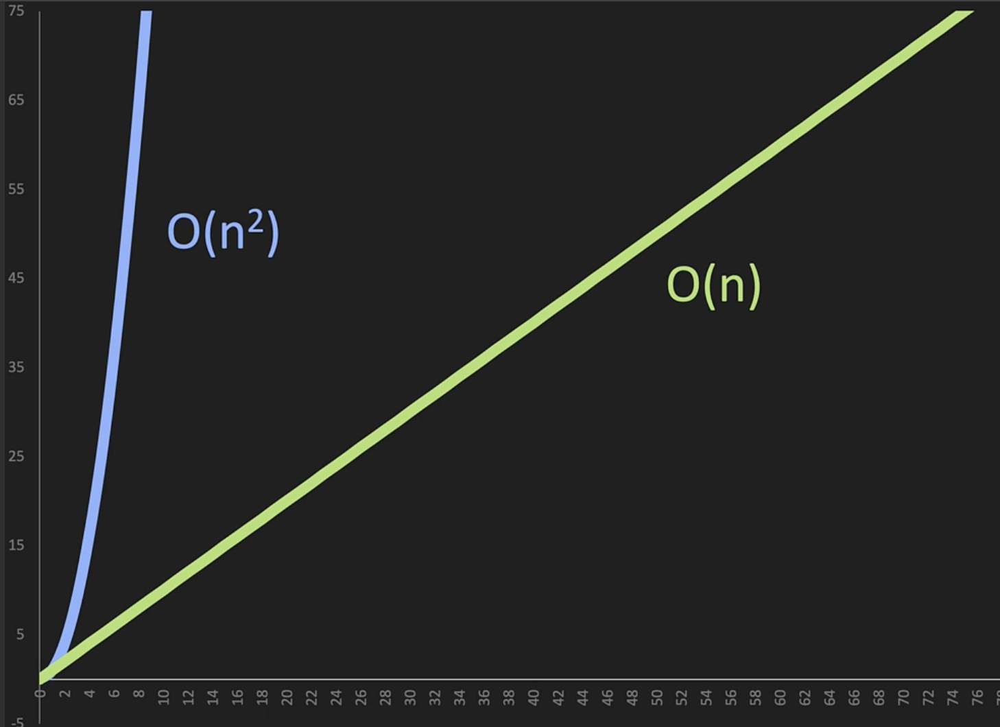
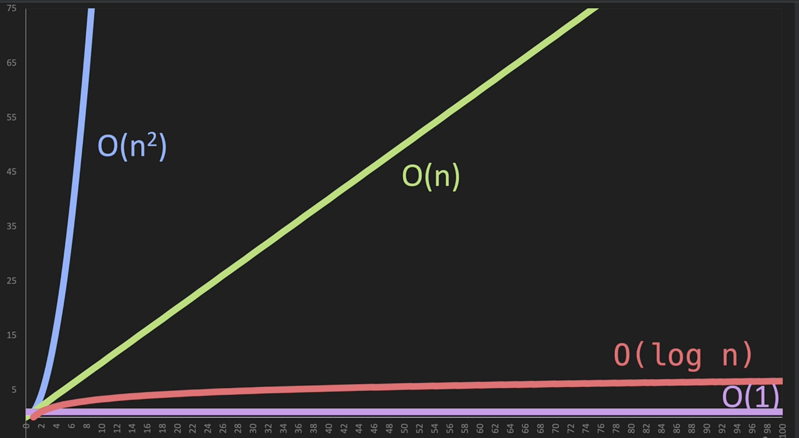

# Big O

- way of comparing two sets of the same code mathematically to measure how efficent they run
- in programming, we measure efficiency through time complexity and space complexity (measures memory)
  - **Time Complexity** which measures the number of operations it takes to complete a task—doesn't measure time at all since finishing quicker doesn't mean it's efficient, just means we have better compute
  - **Space Complexity** which measures how much memory is consumed complete a task

# Omega, Theta, Omicron

When dealing with time and space complexity, we'll often see these greeks

- Omega (Ω) = best case
- Theta (θ) = average case
- Omicron (O) = worst case

These cases are seen even in the simplest programming. In this list, first index of nums is omega and index 6 is the Big O (folks often confuse omega as "best case" big O but big O is literally omicron)!

```python
nums = [1,2,3,4,5,6,7]
```

# Big O(n)

O of n is always a straight line that we call "proportional" and it's when we pass in `n` to run it `n` times. `n` times ran represents the number of operations

```python
# n
def print_nums(n):
    for i in range(n):
        # operation
        print(i)
```

# Drop Constants

A big O notation simplification method, drop constants is when `n + n = 2n` like below function and one would expect to write it as `O(2n)` but in actuality, the constant is dropped and it remains `O(n)`

```python
def print_nums(n):
    for i in range(n):
        print(i)
    for j in range(n):
        print(j)
```

# Big O(n^2)

In the following function, `print_nums(10)` would run 100 operations since it's double loop or `n * n = n^2` or `O(n^2)`

```python
def print_nums(n):
    for i in range(n):
        for j in range(n):
            print(i, j)
```

The graph below shows that `O(n^2)` is much steeper than `O(n)`. In plain english, this means that `O(n^2)` is much less efficient than `O(n)` from time complexity standpoint



# Drop Non-Dominants

A big O notation simplification method, drop non-dominants is when `n^2 + n = n^2` like below function and one would expect to write it as `O(n^2 + n)` but in actuality, the all non-dominants are dropped for simplification and only dominants `n^2` remains to be `O(n^2)`

```python
# dominant as O(n^2)
def print_nums(n):
    for i in range(n):
        for j in range(n):
            print(i, j)

    # non-dominant as O(n)
    for k in range(n):
        print(k)
```

# Big O(1)

Big O of 1, also "constant time", is the most efficient Big O because even if the task increases, the number of operation doesn't increase and remains constant. In below example, even if we trail with another +1, it remains a constant since the number of operation doesn't increase

```python
# dominant as O(n^2)
def add_nums(n):
    return n + n
```

# Big O(log n)

Big O of log n is efficiency through divide and conquer. In below list, the most efficient way to find 1 using `log n` is dividing the list in half three times: `[1,2,3,4]`, `[1,2]`, `[1]`. This is also read as `2^3 = 8` or `log₂8 = 3`

```python
nums = [1,2,3,4,5,6,7,8]
```

`log n` is efficienct because while a typical loop would equate to 8 operations, we only needed 3 operations to complete the task. It is second to only `O(1)` constant in efficiency because imagine needing to process `log₂1,073,741,824=31`—this is iterating over 1B operations vs. 31 operations.



# Big O Terms

When given two parameters, Big O cannot simplify to `O(n)` for `n + n`, it has to be the parameters themselves like so

```python
def print_nums(a, b):
    for i in range(a):
        print(i)
    for j in range(b):
        print(j)
    # results in O(a + b) NOT O(n)

def print_nums_squared(a, b):
    for i in range(a):
        for j in range(b):
            print(i, j)
    # results in O(a * b) NOT O(n)
```
