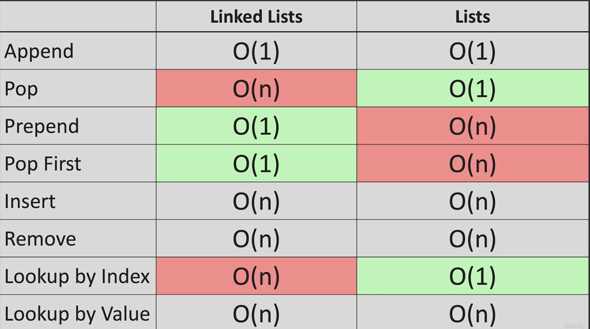

# Linked List

Linked list is a dynamic data structure consisting of a collection of nodes that have its own reference/link that contains data which together represent a sequence. It's not the same as a list and can be much more efficient since it can achieve O(1) when inserting or deleting at the beginning or the middle of a linked list, while list can only achieve O(1) if it's at the end of the list


In the memory space above, notice while the **list** has all its elements stored in contiguous memory locations that are squential and accessible by indexes, the **linked list** consist of nodes that are scattered in memory with no indexes with links that connect them together

# LL in Big O

Linked list can achieve effciency for certain scenarios. For example:

- _append to end is_ `O(1)` since there's only one operation
- _append to start is_ `O(1)`
- _remove to end is_ `O(n)` since iteration is needed to repoint the last node as the new tail
- _append or remove from mid is_ `O(n)` due to iteration
- _lookup is_ `O(n)` due to iteration for both the index and the value. This differs from list since it can be O(1) when looking by index



# LL under the hood

Technically, a LL node is a just dictionary that includes both the pointer and the value. The following illustrates LL with head of 20 and tail of 5 under the hood. Actual LL syntax would be encapsulated in class (see [LL Constructor](#ll-constructor))

```python
head = {
    "value": 20,
    "next": {
        "value": 10,
        "next": {
            "value": 5,
            "next": None
        }
    }
}

print(head['next']['value']) # 10
print(my_ll.head.next.value) # actual LL lookup syntax
```

# LL Constructor

LL always starts with the following classes and methods. Notice how they all accept value and create a new node

- `class LinkedList`
  - `init(self, value)`: create node and initializes LL
  - `append(self, value)`: create node and add node to end
  - `prepend(self, value)`: create node and add node to start
  - `insert(self, value, index)`: create node and insert at given index
- `class Node`
  - `init(self, value)`: create a dict with two properties; value and next

```python
class Node:
    def __init__(self, value):
        self.value = value
        self.next = None

class LinkedList:
    def __init__(self, value):
        new_node = Node(value)
        self.head = new_node
        self.tail = new_node
        self.length = 1

    def append(self, value):
        new_node = Node(value)
        if self.head is None:
            self.head = new_node
            self.tail = new_node
        else:
            self.tail.next = new_node
            self.tail = new_node
        self.length += 1
        return True

    def print_list(self):
        temp = self.head
        while temp is not None:
            print(temp.value)
            temp = self.next

my_linked_list = LinkedList(4)
print(my_linked_list.head.value)
print(my_linked_list.length)
```

# LL pop

Pop in LL is much more complex as it is O(n) to remove the tail and reassign the new tail. There are two edge cases:

- **LL is empty**: The first condition exits the operation completely to satisfy empty LL
- **LL with single node**: The second condition resets LL to empty after removing the single node with `self.length` decrement
- **LL more than one node**: The second condition resets LL to empty after removing the single node with `self.length` decrement

Overall, pop will iterate until reaching the last node and removes the last node by setting `pre` to `None`

```python
def pop(self):
    if self.length == 0:
        return None
    temp = self.head
    pre = self.head
    while temp is not None:
        pre = temp
        temp = self.next
    self.tail = pre
    self.tail.next = None
    self.length -= 1
    if self.length == 0:
        self.head = None
        self.tail = None
    return temp
```

# LL prepend, pop_first, get, set, insert

```python
def prepend(self, value):
    new_node = Node(value)
    if self.length == 0:
        self.head = new_node
        self.tail = new_node
    else:
        new_node.next = self.head
        self.head = new_node
    self.length += 1
    return True

def pop_first(self, value):
    if self.length == 0:
        return None
    temp = self.head
    self.head = self.head.next
    temp.next = None
    self.length -= 1
    if self.length == 0:
        self.tail = None
    return temp

def get(self, index):
    if index < 0 or index >= self.length:
        return None
    temp = self.head
    for _ in range(index):
        temp = temp.next
    return temp

def set_value(self, index, value):
    temp = self.get(index)
    if temp:
        temp.value = value
        return True
    return False

def insert(self, index, value):
    if index < 0 or index >= self.length:
        return None
    if index == 0:
        self.prepend(value)
    if index == self.length:
        self.append(value)
    new_node = Node(value)
    temp = self.get(index - 1)
    new_node.next = temp.next
    temp.next = new_node
    self.length += 1
    return True
```
