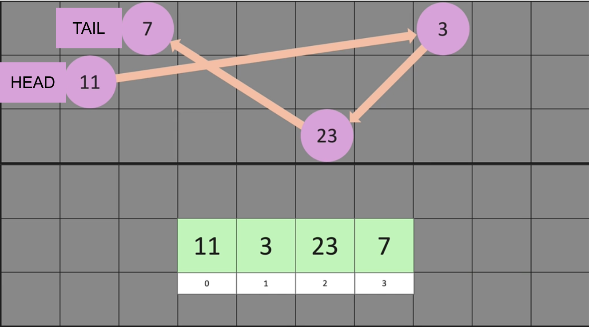

# Linked List

Linked list is a dynamic data structure consisting of a collection of nodes that have its own reference/link that contains data which together represent a sequence. It's not the same as a list and can be much more efficient since it can achieve O(1) when inserting or deleting at the beginning or the middle of a linked list, while list can only achieve O(1) if it's at the end of the list

In the memory space above, notice while the **list** has all its elements stored in contiguous memory locations that are squential and accessible by indexes, the **linked list** consist of nodes that are scattered in memory with no indexes with links that connect them together
