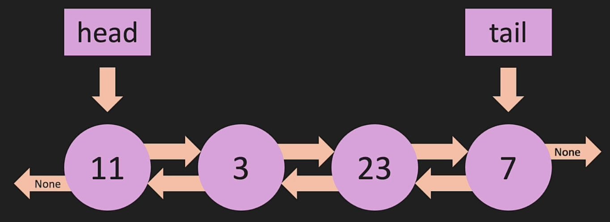

# Doubly Linked List

Doubly linked list is just a singular linked list with pointers that also goes backwards and thus, necessitates `self.prev` in DLL nodes.



In DLL constructors and DLL node constructor, not much change except again, reverse pointers:

```python
class Node:
    def __init__(self, value):
        self.value = value
        self.next = None
        self.prev = None

class DoubleLinkedList:
    def __init__(self, value):
        new_node = Node(value)
        self.head = new_node
        self.tail = new_node
        self.length = 0
```

# Doubly Linked List Append

Doubly linked list append is similar to singular linked list with exception that after appending, the new node needs to set previous to the current tail through `new_node.prev = self.tail` prior to setting itself as the tail

```python
def append(self, value):
    new_node = Node(value)
    if self.head is None:
        self.head = new_node
        self.tail = new_node
    else:
        self.tail.next = new_node
        new_node.prev =  self.tail
        self.tail = new_node
    self.length += 1
    return True
```

# Doubly Linked List Methods

In singular, pop is O(n) but is O(1) in doubly since we're given `self.tail.prev`

```python
def pop(self):
    if self.length == 0:
        return None
    temp = self.tail
    if self.length == 1:
        self.head = None
        self.tail = None
    else:
        self.tail = self.tail.prev
        self.tail.next = None
        temp.prev = None
    self.length -= 1
    return temp

def prepend(self, value):
    new_node = Node(value)
    if self.head is None:
        self.head = new_node
        self.tail = new_node
    else:
        new_node.next = self.head
        self.head.prev = new_node
        self.head = new_node
    self.length += 1
    return True

def pop_first(self):
    if self.length == 0:
        return None
    temp = self.head
    if self.length == 1:
        self.head = None
        self.tail = None
    else:
        self.head = self.head.next
        self.head.prev = None
        temp.next = None
    self.length -= 1
    return temp

def get(self, index):
    if index < 0 or index >= self.length:
        return None
    temp = self.head
    if index < self.length/2:
        for _ in range(index):
            temp = temp.next
    else:
        temp = self.tail
        for _ in range(self.length - 1, index, -1):
            temp = temp.prev
    return temp

def set_value(self, index, value):
    temp = self.get(index)
    if temp:
        temp.value = value
        return True
    return False

def insert(self, index, value):
    if index < 0 or index >= self.length:
        return False
    if index == 0:
        return self.prepend(value)
    if index == self.length - 1:
        return self.append(value)

    new_node = Node(value)
    before = self.get(index - 1)
    after = before.next

    new_node.prev = before
    new_node.next = after
    before.next = new_node
    after.prev = new_node

    return True
```
