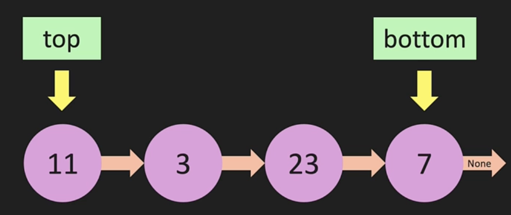
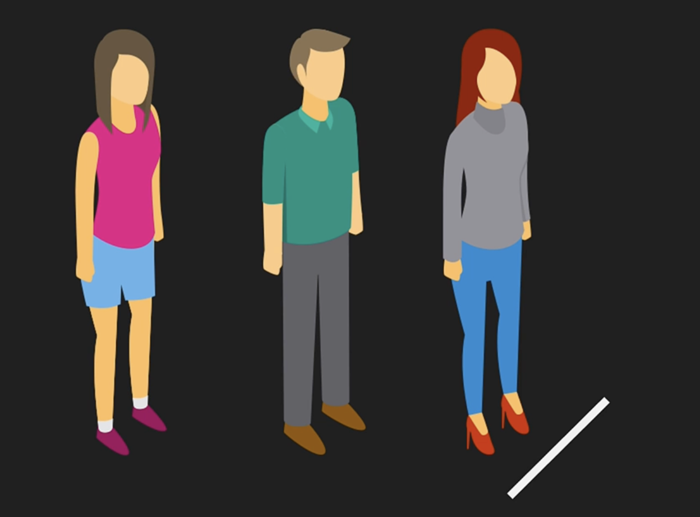

# Stack

For something to be a **stack**, it has to be something that we can add to or remove from the same "in". Stack is like the can of tennis balls below where for the first ball that went in to come out, all the balls after it would need to come out first (i.e. `LIFO`)


- In **software engineering**, this concept is commonly seen in back paging of browser history. In the example below (e.g. pages visits may start at FB then YT, IG, and G). To get back to the first visted page, FB, we'd need to back three times (again, `LIFO`)


- In a List, a stack is when we add through append and pop to and from the end, respectively
- In a Linked List, the stack must have the head as the `Top` and the tail as the `Bottom` like below. This is because if the tail is the top, then removing a node from a singluar LL would be O(N) as we'd need to loop through to set the previous node (`value = 23`) as the new tail.



- The example above results in O(1) for both add or remove (of course, this would be different with doubly)

# Stack Constructor

Notice `__init__` only haas `self.top` equivalent to `self.head`. Again, this is because we're adding/removing only at the top

```python
class Node:
    def __init__(self, value):
        self.value = value
        self.next = None

class LinkedList:
    def __init__(self, value):
        new_node = Node(value)
        self.top = new_node
        self.height = 1

    def push(self, value):
        new_node = Node(value)
        if self.height == 0:
            self.top = new_node
        else:
            new_node.next = self.top
            self.top = new_node
        self.height += 1

    def pop(self):
        if self.height == 0:
            return None
        temp = self.top
        self.top = self.top.next
        temp.next = None
        self.height -= 1
        return temp

    def print_stack(self):
        temp = self.top
        while temp:
            print(temp.value)
            temp = temp.next
```

# Queue

Unlike stack, which adds and removes on the same "in", a **queue** is when something can be added to on one end (`enqueue`) but is removed on the other end (`dequeue`). Queue is like a line of people below where first person that went in the last is the first person out (i.e. `FIFO`)



In a List, we couldn't achieve O(1) in queue since only adding/removing on one end can be O(1) would result in adding/removing on the other end as O(N)

In a Linked List, O(1) can be achieved if `dequeue` on the the tail and `enqueue` on the head since enqueue on the tail would result in O(N). In this scenario, head is `first` and `last`
