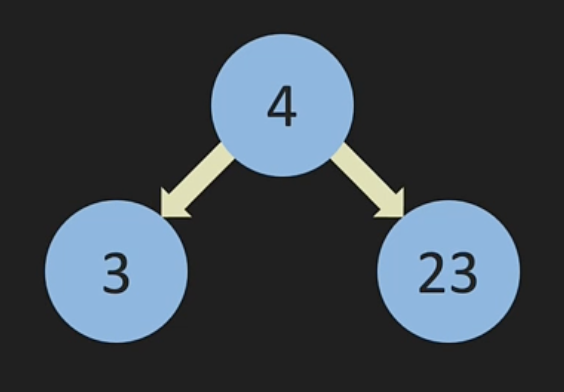
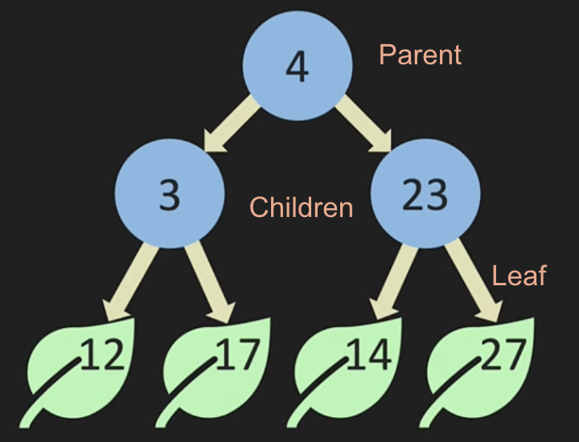
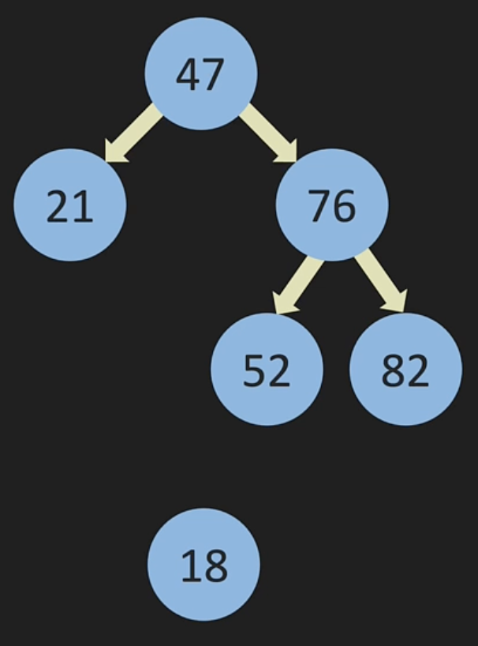

# Tree

Tree is another form of Linked List that forks like so:



In a dict, the tree would have left and right nodes:

```python
{
    value: 4,
    left: {
        value: 3,
        left: None,
        right: None,
    },
    right: {
        value: 23,
        left: None,
        right: None,
    }
}
```

In above examples, these are binary trees. However, trees don't have to binary and can point to unlimted nodes. In binary trees, it is:

- `Full tree` if a node points to either two nodes or no node at all
- `Perfect tree` if all nodes is full/filled all the way across
- `Complete tree` if all nodes are full/filled from left to right


Every node in a tree can only have one `Parent`. Parent in binary trees can have two `Children`. If parents have no children, these nodes are a `leaf` like so:



# Binary Search Trees

Binary search tree is when new nodes are added by the following conditions:

- `Greater than` if a node is greater than the node before it, it must be added to the right
- `Less than` if a node is less than the node before it, it must be added to the left

If for instance a node exist already, then keep following down that node. For example, `18` is less than 47 so go to the left. Since there's a node there and is less than 21, then 18 will will be on the left of 21.



Suppose we add `30` as well then this new node would be the right of 21.
