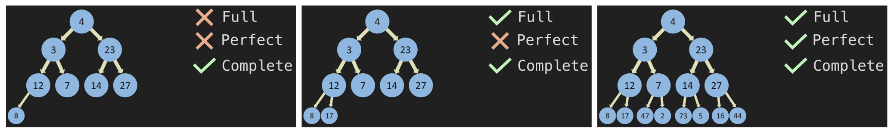

# Tree

Tree is another form of Linked List that forks like so:


In a dict, the tree would have left and right nodes:

```python
{
    value: 4,
    left: {
        value: 3,
        left: None,
        right: None,
    },
    right: {
        value: 23,
        left: None,
        right: None,
    }
}
```

In above examples, these are binary trees. However, trees don't have to binary and can point to unlimted nodes. In binary trees, it is:

- `Full tree` if a node points to either two nodes or no node at all
- `Perfect tree` if all nodes is full/filled all the way across
- `Complete tree` if all nodes are full/filled from left to right



Every node in a tree can only have one `Parent`. Parent in binary trees can have two `Children`. If parents have no children, these nodes are a `leaf` like so:


# Binary Search Trees

Binary search tree is when new nodes are added by the following conditions:

- `Greater than` if a node is greater than the node before it, it must be added to the right
- `Less than` if a node is less than the node before it, it must be added to the left

If for instance a node exist already, then keep following down that node. For example, `18` is less than 47 so go to the left. Since there's a node there and is less than 21, then 18 will will be on the left of 21.


Suppose we add `30` as well then this new node would be the right of 21.

# BST Height and Big O

In BST, the number of steps to reach a value can be calculated using `Height` or `h` in the formula `2^(h+1) - 1` like below. In the first fork from 47, the height is 1 or it'd take 1 step to perform lookup, insert, or remove. For value 49, it'd take 4 steps to retrieve or add value 48.


In short, BST has the capability to divide and conquer. By leveraging BST, we can reach certain values without ever having to access the other half of the tree; thus, `O(log n)` is achievable for certain methods like lookup or removing to be much more efficient than a linked list. Other things to note:

- When the tree becomes really large, the -1 becomes insignificant and is often referred to as `2^4` (rather than the full formula of 2^4 - 1)
- BST is equivalent to a regular linked list when retrieval is linear. Imagine in above example when trying to reach `91`—it'd be a linear path or `O(n)` and is exactly like a linked list
- BST has three methods: lookup, remove, and insert. Insert is actually more efficient in Linked List since it can append to the end directly and sorting is useless in linked list whereas BST requires conditions to add to proper parent and height

Ultimately, `there's no data structure that's the best in all situations` and here, we must determine when it's best to leverage BST or Linked List. For example:

- imagine a scenario where we must add data to a data structure very quickly since incoming data comes in bursts but retrieval doesn't happen often and it's less important

Given inserting is `O(1)` in Linked List, this scenario calls for Linked List since BST would be `O(log n)` here

# BST Constructor

```python
class Node:
    def __init__(self, value):
        self.value = value
        self.left = None
        self.right = None

class BinarySearchTree:
    def __init__(self):
        self.root = None

    def insert(self, value):
        new_node = Node(value)
        if self.root is None:
            self.root = new_node
            return True
        temp = self.root
        while (True):
            if value == temp.value:
                return False
            if value < temp.value:
                if temp.left is None:
                    temp.left = new_node
                    return True
                temp = temp.left
            else:
                if temp.right is None:
                    temp.right = new_node
                    return True
                temp = temp.right
        return False

    def contains(self):
        temp = self.root
        while temp is not None:
            if value < temp.value:
                temp = temp.left
            elif value > temp.value:
                temp = temp.right
            else:
                return True
        return False


my_tree = BinarySearchTree()
print(my_tree.root)

my_tree.insert(2)
my_tree.insert(1)
my_tree.insert(3)

print(my_tree.root.value)
print(my_tree.root.left.value)
print(my_tree.root.right.value)
```
