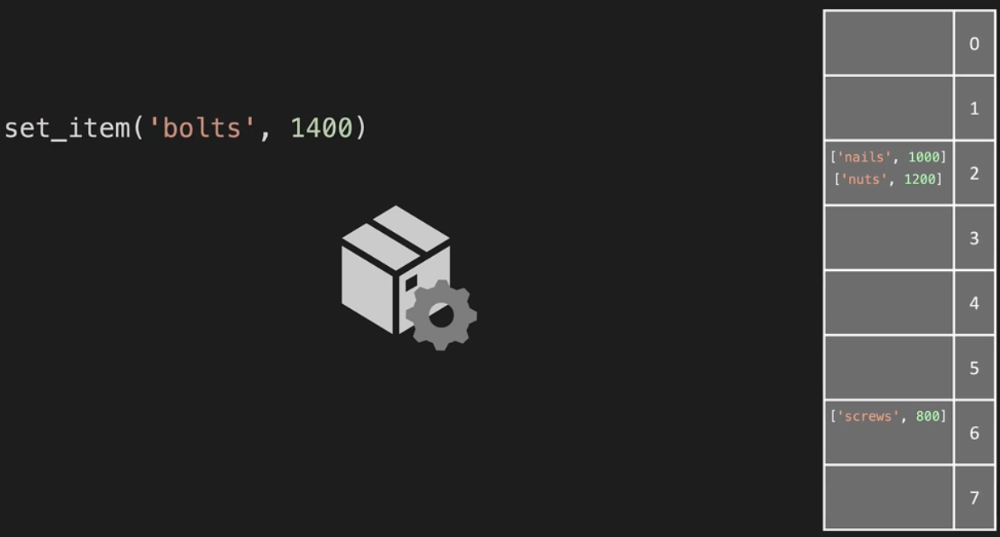
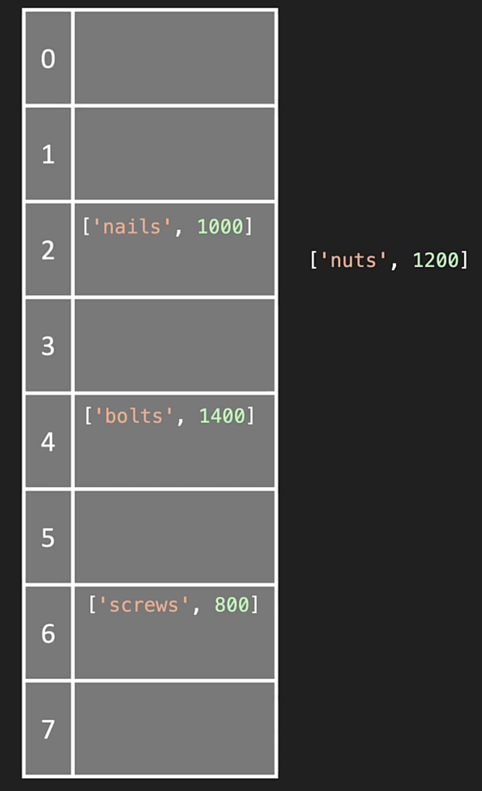
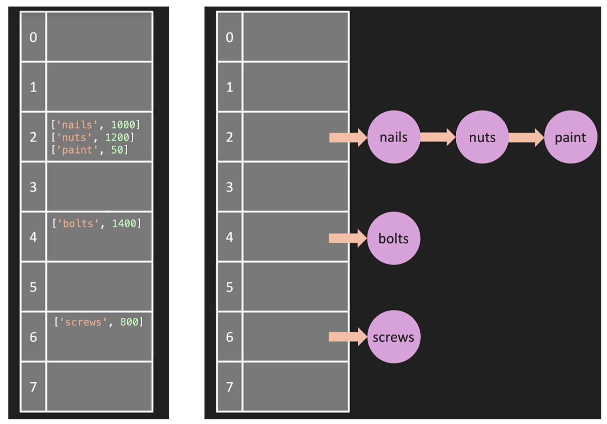

# Hash Tables

Hash is a method/function that accepts a dictionary, storing it into a hash table with a designated `address` that it returns. Hash has two characteristics:

- `One way` - meaning if we pass a key-value pair, hash will return an adress but if we pass said address, the key-value will not be returned
- `Deterministic` - means an address will be returned for every pair passed

In the example below, we can pass `{"nails": 1000}` into the hash `set_items(key, value)` function like so:



The hash function adds the pair as a list and returns an address. To retrieve the value, we can do `get_item('screws')` and since hash are deterministic, we have the address to easily retrieve the value of screws which is 800.

**NOTE**: each address can contain more than a single pair. To retrieve the quantity of nuts, we'd need to loop through address 2

# HT Collisions

In hash tables, when an address has two key-value pairs or more then it is known as `collisions`. We have multiple techniques to deal with collisions:

**Separate Chaining** - when placing multiple pairs into an address using a list

```python
[['nail', 1000], ['nuts', 1200]]
```

**Linear Probing** - a form of `open addressing` where we loop through the hash table and add to an address only when it's empty. In the following example, instead of separate chaining `nuts`, we can add to address 3.



When using **separate chaining**, we can also use a linked list where we access the address and loop through linked list until value of `paint` is retrieved. The following illustrates that iterations at an address can happen for both a regular list vs. linked list:



# HT Constructor

**NOTE**: When using hash tables, always create a table with prime numbers of addresses (e.g. instead of 0-7, opt for 0-6). Prime number of addresses increases the number of randomness for how the key-value pairs are distributed through the hash tables (i.e. reduces the collisions).

```python
class HashTable:
    def __init__(self, size = 7):
        self.data_map = [None] * size

    def __hash(self, key):
        my_hash = 0
        for letter in key
            # ord(letter) - ordinal function returns the ascii number of a letter
            # * 23 - a prime number (we could plug any prime number)
            # % - modulo operator to return the remaining when dividing. When dividing by our size of 7, modulo will return remainders of 0-6 (our address space)
            my_hash = (my_hash + ord(letter) * 23) % len(self.data_map)
        return my_hash

    def set_item(self, key, value):
        index = self.__hash(key)
        if self.data_map[index] == None:
            self.data_map[index] = []
        self.data_map[index].append([key, value])

    def get_item(self, key):
        index = self.__hash(key)
        if self.data_map[index] is not None:
            for i in range(len(self.data_map[index]))
                if self.data_map[index][i][0] == key:
                    return self.data_map[index][i][1]
        return None

    [[['bolt', 100], ['bolt', 100]], None]

    def get_keys(self):
        keys = []
        for address in self.data_map:
            if address is not None:
                for item in address:
                    keys.append(item[0])
        return keys

    # len approach
    def keys(self):
        keys = []
        for i in range(len(self.data_map)):
            if self.data_map[i] is not None:
                for j in range(len(self.data_map[i])):
                    keys.append(self.data_map[i][j][0])
        return keys

    def print_table(self):
        for i, val in enumerate(self.data_map):
            print(i, ": ", val)

my_hash_table = HashTable()
my_hash_table.print_table()

my_hash_table.set_item('bolts', 1400)
my_hash_table.set_item('washers', 50)
my_hash_table.set_item('lumber', 70)

my_hash_table.print_table()

print(my_hash_table.get_item('lumber'))
print(my_hash_table.keys())
```

# HT Big O

The implementation of hash table here breaks down to the following Big O time complexity. However, when using python built-in hash method, we can achieve O(1) since it utilizes dictionary and accessing items of an address is as simple as using a key-value pair retrieval

- `set_item` is O(1)
- `get_item` is O(n)
- `get_keys` is O(n^2)

# Item in Common: Naive versus Efficient approach

In programming, we can implement a solution that's naive that emphasizes simplicty, most direct, and doesn't consider complexity and efficiency. In the following example, the first function accomplishes the problem but results in `O(n^2)` whereas the second approach results in `O(n)` since the constant in 2n is dropped.

```python
[1,3,5]
[2,4,5]

def item_in_common(list1, list2):
    for i in list1:
        for j in list2:
            if i == j:
                return True
    return False

def item_in_common_efficient(list1, list2):
    items = {}
    for i in list1:
        items[i] = True

    for j in list2:
        if i in items:
            return True
    return False
```
