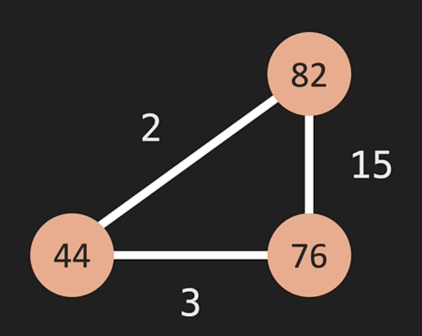
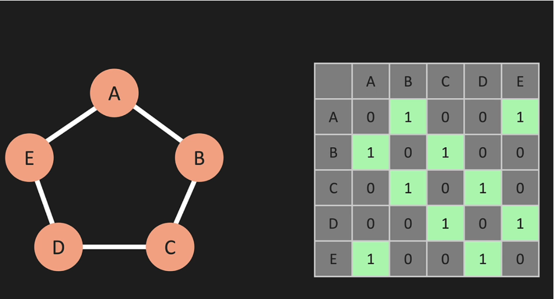
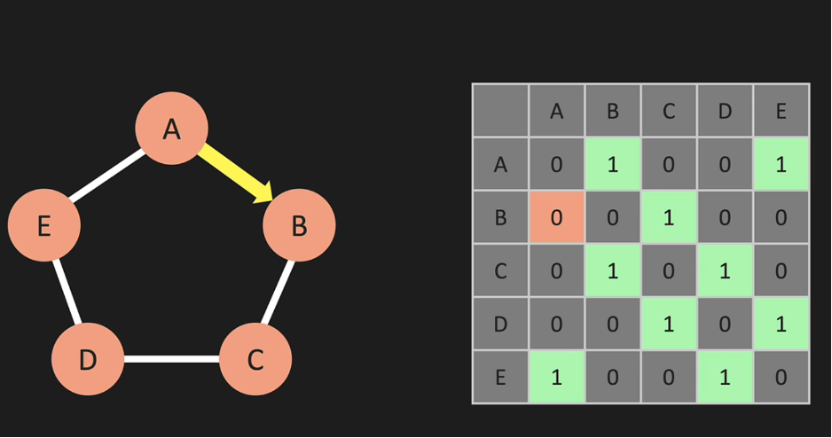
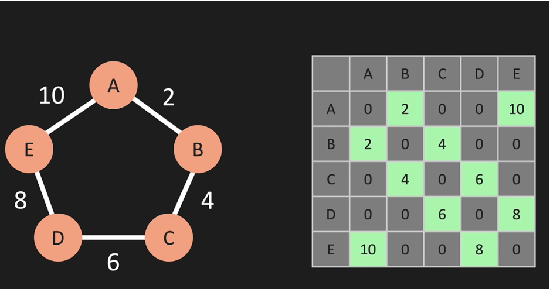
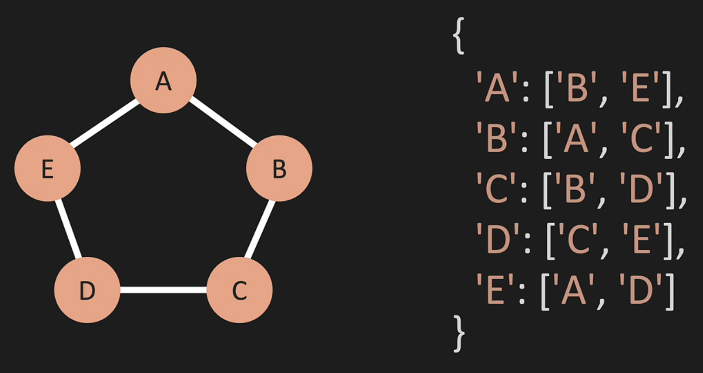
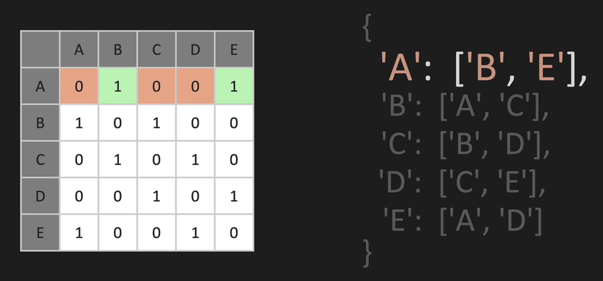
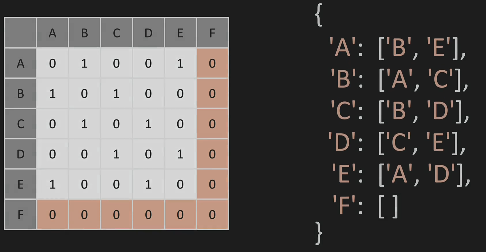
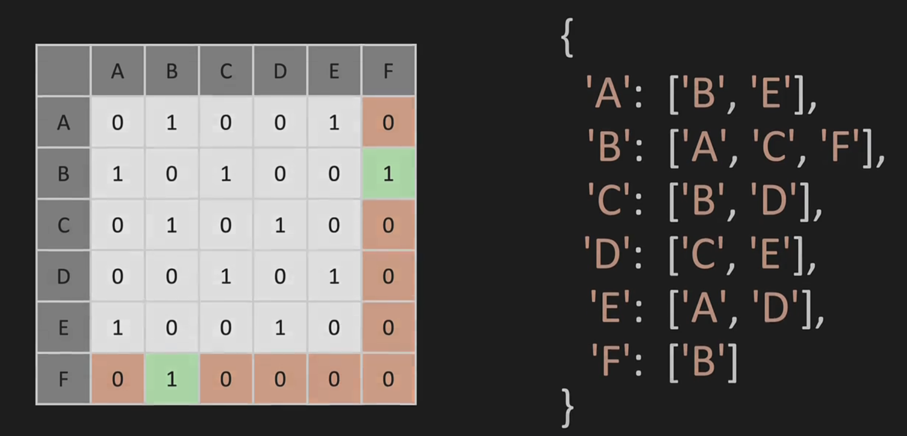

# Graphs

Graphs are data structures used when representing entities and relationships between them. We've seen graphs before—things like linked list and trees are forms of graphs but they have limitations such as pointing to only one other node and two nodes at a time, respectively.

A graph consists of the following:

- **Vertex (vertices)** - also known as 'nodes' with values. Vertices can connect to one or many relationships with no limitations
- **Edge** - also known as 'connections' to connect vertices together. Edges can be directional or bi-directional
- **Weight** - each edge have weighs in graphs and helps identify the most opimal path to connect vertices together

For example, in the following graph, the most optimal way to connect `76` and `82` vertices, is actually 2-step through 3 and 2 which has less cost than the than 1-step of 15. Graph logic are often used in networking and things like Google Maps.



Actual graphs where vertices have many edges looks like so:


When edges are bi-direction like above, they do not have arrows pointing to the vertex. If they are directional. then they do

# Graphs representation

The following are two ways to represent a graph:

- Adjacency Matrix
- Adjacency List

### Adjacency Matrix

The following matrix's y-axis representing the vertices and x-axis representing the edges that connects the vertices.



The following matrix has one vertex (A to B) that's directional:



The following matrix edges have weighs which represents the values in the matrix cells:



### Adjacency List

Similar to **adjacency matrix**, which represents graphs in a matrix, **adjacency list** represents graphs in a dictionary. The keys are the vertices and the paired values are lists of its edges.



# Graphs Big O

When comparing **space complexity**:

- `Adjacency matrix` stores all vertices that it's not connected to and makes it `O(|V|^2)`, number of vertices squared
- `Adjacency list` stores only the edges it's connected to and makes it `O(|V|+|E|)`, number of vertices plus number of edges



When **adding a vertex** like `F` below:

- `Adjacency matrix` is complex as it requires rewriting the entire matrix to add a new row and column; thus, `O(|V|^2)` or number of vertices squared
- `Adjacency list` can be simple as it is just a dictionary at a space complexity of `O(1)`



When **adding an edge** `F` to `B` like below, both are `O(1)`:



As for other graph operations:

- **To remove edges**: matrix is `O(1)` and list is `O(|E|)` of number of edges we need to loop through to find and remove
- **To remove vertices**: matrix is `O(|V|^2)`, number of vertices squared, since we have to rewrite the whole matrix and list is `O(|V| + |E|)`, number of vertices + number of edges to loop through to find and remove the vertex as the edges in other vertices

Overall, **adjacency list** is much more efficient and preferable especially from a space complexity perspective. For instance, imagine building Facebook with matrix graphs and you have 1B users (i.e. vertices), you'd have 1B rows and 1B columns even if each user has only thousand friends (e.g. 1000 of 1B columns will be 1's and the rest 0's)

# Graphs Constructor

```python
class Graph:
    def __init__(self):
        self.adj_list = {}

    def add_vertex(self, vertex):
        if vertex not in self.adj_list.keys():
            self.adj_list[vertex] = []
            return True
        return False

    def add_edge(self, v1, v2):
        keys = self.adj_list.keys()
        if v1 in keys and v2 in keys:
            self.adj_list[v1].append(v2)
            self.adj_list[v2].append(v1)
            return True
        return False

    def remove_edge(self, v1, v2):
        keys = self.adj_list.keys()
        if v1 in keys and v2 in keys:
            self.adj_list[v1].remove(v2)
            self.adj_list[v2].remove(v1)
            return True
        return False

    def remove_vertex(self, vertex):
        if vertex in self.adj_list.keys():
            for other_vertex in self.adj_list[vertex]:
                self.adj_list[other_vertex].remove(vertex)
            del self.adj_list[vertex]
            return True
        return False

    def print_graph(self):
        for vertex in self.adj_list:
            print(vertex,':', self.adj_list[vertex])
```
