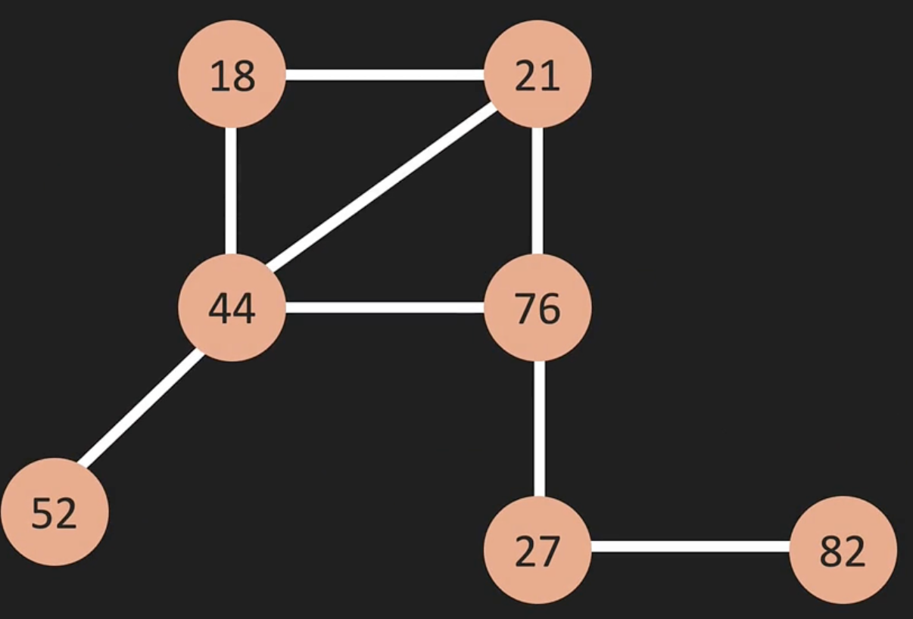

# Graphs

Graphs are seen before—things like linked list and trees are forms of graphs but they have limitations such as pointing to only one other node and two nodes at a time, respectively. A graph consists of the following:

- **Vertex (vertices)** - also known as 'nodes' with values. Vertices can connect to one or many relationships with no limitations
- **Edge** - also known as 'connections' to connect vertices together. Edges can be directional or bi-directional
- **Weight** - each edge have weighs in graphs and helps identify the most opimal path to connect vertices together

For example, in the following graph, the most optimal way to connect `76` and `82` vertices, is actually 2-step through 3 and 2 which has less cost than the than 1-step of 15. Graph logic are often used in networking and things like Google Maps.

Actual graphs where vertices have many edges looks like so:

When edges are bi-direction like above, they do not have arrows pointing to the vertex. If they are directional. then they do

# Graphs representation

The following are two ways to represent a graph:

- Adjacency Matrix
- Adjacency List

#### Adjacency Matrix

The following matrix's y-axis representing the vertices and x-axis representing the edges that connects the vertices.

The following matrix has one vertex (A to B) that's directional:

The following matrix edges have weighs which represents the values in the matrix cells:

