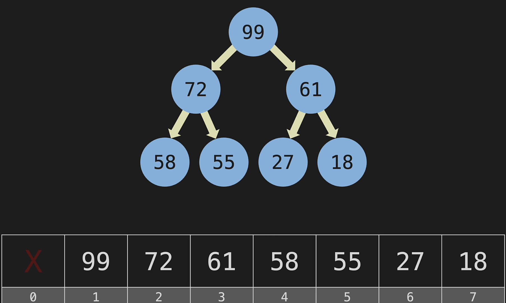
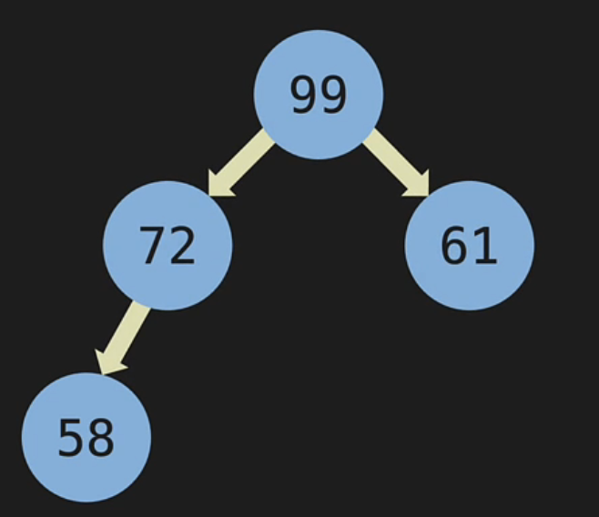

# Heap

Heap is a binary search tree that has its numbers distributed in a different way where the highest value will always be at the top and its descendents (values less than or equal to) are at the bottom if it's a `max heap` or lowest value at the top if it's a `min heap`. For a binary search tree to be a heap, these conditions also must be met:

- a complete tree (i.e. every node must have both children)
- unlike regular trees, heaps can also have duplicated nodes (i.e. equal to)
- it doesn't matter where the lowest values are in the tree as long as it is a value less than or equal to its parents

This means that heaps are not great for searching, but it's great for keeping track of the highest values at the top and quickly remove it

# How heaps are stored

Heaps are stored in a list, so a **node class** isn't needed like trees. However, heaps only store integers in the list and said integers can be stored two ways:

- root at index 0
- root at index 1

### Root at index 1



Since the heap integers are added to lists in a contiguous pattern, starting with index 1 makes the math simple. Examples:

- Finding left child: `2 * parent_index`
- Finding right child: `2 * parent_index + 1`
- Finding parent of left child: `child_index / 2` (assume index 6, then 3)
- Finding parent of right child: `child_index / 2` (assume index 7, then 3 since integer division drops .5 of 3.5)

### Root at index 0

When leading with index 0 for heaps, we'd need to move over one index. Below, notice in every equation, we simply moved one index from formulas used when leading with index 1:

```python
class MaxHeap:
    def __init__(self):
        self.heap = []

    def _left_child(self, index):
        return 2 * index + 1

    def _right_child(self, index):
        return 2 * index + 2

    def _parent(self, index):
        return (index - 1) + 2

    def _swap(self, index1, index2):
        self.heap[index1], self.heap[index2] = self.heap[index2], self.heap[index1]
```

# Insert value into heap



In above heap, insertion can happen using `while` loop with the following (assume we want to insert 100 and 75):

- insert the value at the next contiguous index open even if the value is greater than the current parent (i.e. .append(100) which would be under 72)
- in the while loop, keep swapping with parent using integer division and exit when either these two conditions are met: top of the tree reached (i.e. index 1) or child is less than its parent

```python
    def _insert(self, value):
        self.heap.append(value)
        current = len(self.heap) - 1

        while current > 0 and self.heap[current] > self.heap[self._parent(current)]:
            self._swap(current, self._parent(current))
            current = self._parent(current)
```
